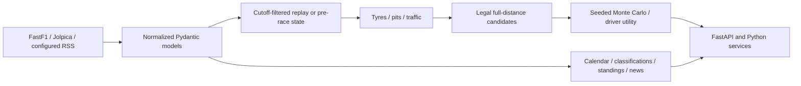

# Backend platform v2

## Boundaries and compatibility



The original `src/f1_pitwall` layout, fixture loader, replay builder, analytical tools and legacy
immediate-strategy endpoint are retained. No new frontend, agent, MCP or RAG system was built.
`simulation/models.py`, `plans.py`, `state.py` and `race.py` implement reusable Python services.
`intelligence/` owns provider normalization, calendar selection and news. Provider JSON does not
enter the numerical engine. New dependencies are explicit NumPy and defusedxml.

Normalized race fixtures use provider `DriverId` identities, with session-specific abbreviation,
team ID and grid position. An absent provider identity falls back to a **season-scoped race number**;
that fallback cannot establish cross-season identity. There is no driver/team roster in production
code. The generated demo uses configurable synthetic entrants (`create_demo_dataset(field_size)`),
defaulting to 22. Existing clients can resolve an unambiguous abbreviation through the service.
Re-ingest old fixtures to obtain stable provider IDs; old abbreviation-keyed fixtures still load.
Snapshot schema version is now `2.0`; new state fields are additive.

## Evidence and missing data

Replay uses records with `lap_number <= cutoff_lap`. Timing, tyre fitting, stop estimation,
strategy inputs and chart data share that boundary. Future mutation tests change later compounds,
lap times and statuses and assert unchanged state and predictions. Race distance is read from the
**first positive pre-start TotalLaps observation**, never the final lap count or a later correction.
When pre-start distance is unavailable, ingestion requires `--total-laps` rather than guessing.

Replay retains the existing **driver-lap-aligned** semantics: each driver's latest completed lap
up to N. It is not a synchronized wall-clock reconstruction at the instant the leader crosses
lap N. Missing-lap deficits are exposed as `laps_behind`; precise blue-flag/lapped-car interactions
would require a synchronized timing model. No later driver lap is used.

Every registered entrant appears, even without a lap. Missing timing remains `UNKNOWN`, rather
than an inferred DNF. Optional `StatusRecord(driver_id, source_lap, status)` observations support
DNS, retirement, DSQ and finished states without requiring a fabricated completed lap. FastF1's
final result status is deliberately not backfilled into earlier replay. Its missing retirement
feed therefore remains a limitation. Explicit inactive entrants are excluded from strategy and
listed separately in its response.

Tyre fitting excludes inaccurate, pit-in/out, SC/VSC/red-flag laps and severe median-based outliers.
Its confidence is an evidence heuristic; observed lap trends still confound fuel, traffic and tyres.
Tyre life is a simple pace-loss estimate, not a physical wear measurement. Stop loss uses visible
clean in/out-lap excess when available, otherwise a labeled configurable fallback. Wet observations
and missing optional data reduce certainty; weather transitions are not simulated.

Pre-race evidence has both `observed_at` and `available_at`. Both must be at or before `as_of`,
and `as_of` must precede race start. UTC-aware timestamps are required. Caller-provided historical,
FP, driver and team pace estimates are blended with transparent source weights; this is not an
automated long-run extraction or circuit-model training pipeline. Callers must supply truthful
provenance. The engine never reads the target race's results to build a pre-race state.

The next-race endpoint uses FastF1's **qualifying session roster**, retaining non-classified
entrants that Jolpica qualifying classifications may omit. It uses a low-confidence qualifying
pace proxy (best time plus 4%), with explicit fallback pace for missing times. The grid is
**provisional qualifying order**; steward penalties and official entry eligibility need caller
verification. To avoid using partial qualifying results without downloading car telemetry,
FastF1 requires an observed `Ends` status and conservatively waits until the scheduled Q end plus
observed feed duration. Predictions can be unavailable for a while after qualifying actually ends.
Historical revisions to provider classifications are not archived as publication-time versions.

## Strategy and simulation interpretation

`RaceRules` configures compounds, pace offsets, degradation, tyre life, remaining set allocations,
mandatory dry specifications, two-dry-compound requirement, minimum/maximum stops, pit loss,
out-lap cost, overtaking threshold, traffic headway and points. Defaults are generic assumptions,
not event-specific tyre nominations or automatic FIA rule updates. Set sprint/wet/special-event
rules explicitly; Monaco stop mandates, 2021 starting-tyre rules, shortened-race points and future
regulation changes must be configured by the caller. See the [FIA regulations](https://www.fia.com/regulations/formula-1).

The planner enumerates legal no-stop and multi-stop finishes, including immediate changes for
exhausted tyres. It accounts for current age, used compounds, laps remaining and configured life.
It samples stop timings, ranks candidates by modeled elapsed time including rejoin traffic, and
retains up to 16 candidates. A reported pit window spans first-stop timings within two modeled
seconds of the selected plan. It is a sampled competitive window, not a proof of optimality.
An infeasible rule/allocation combination returns an explicit error instead of an illegal plan.

Monte Carlo trials model starting order, driver pace, compound pace, degradation, stops, pit loss,
random lap/underlying race pace and a lap-wise overtaking approximation. Trials are vectorized
with NumPy and use a local seeded RNG. Counts 1–5000 are accepted, including 100/500/1000/5000.
The same state, software versions, sample count and seed produce identical results.

Each driver's two fastest legal candidates are simulated against fixed rival baseline plans,
using common random numbers. Smooth utility weights emphasize protecting wins at the front,
points in midfield and plausible gains/points upside toward the rear, with downside penalties.
This is **conditional strategy comparison**, not a joint game-theoretic solution. The combined
recommendations and marginal finish distributions need not form a single consistent race field.
`most_successful_strategy` means best driver utility among the two simulated candidates.

Outputs include expected/median finish, expected gain and points, finish distribution, points,
top-10, podium and win probabilities, P5 finish-position upside and P95 downside, primary and
alternative plans, opportunity/threat, pit window and confidence. Predictions are uncalibrated
model estimates, not certainty. No SC/VSC incidents, rain transitions, start randomness,
reliability events or pit-stop variance are forecast. Safety-car and red-flag observations are
filtered from pace fitting; wet races require suitable compound models and assumptions.

## Providers

- FastF1 3.x: cached timing/session rosters and separate qualifying rosters. A small adapter uses
  FastF1's internal lap-count reader to enforce pre-start distance provenance; contract tests cover it.
- [Jolpica](https://github.com/jolpica/jolpica-f1/blob/main/docs/README.md): paginated seasons
  (filtered from 2021, no latest-year ceiling), drivers, constructors, calendar, qualifying,
  sprint/race results and standings. A bounded five-minute cache and custom User-Agent reduce calls.
  Timeouts, rate limits and HTTP failures surface as unavailable, not invented current information.
- RSS/Atom: optional `PITWALL_NEWS_FEEDS`, comma-separated. Reads feed metadata only, strips HTML
  from snippets, caps them at 300 characters, deduplicates canonical URLs/headlines, classifies
  headlines and accepts dynamic entity tags. Secure XML parsing rejects entities; unavailable feeds
  return warnings. The API supplies selected-session driver/team tags. No complete articles are copied.

Jolpica sessions are discovered from dated objects, so normal, sprint and future session names work.
Unknown times stay null. Next-event/session searches include provider-published future seasons.
`current_event` means the calendar weekend through four hours after scheduled race start, not a
live race status. `/grid` uses actual grid fields for completed races, otherwise labels qualifying
order provisional. Upcoming predictions use the separate qualifying roster path.

## API

All new routes use `/api/v1`; `/health` and existing routes are retained. OpenAPI is at `/docs`.

| Route | Purpose |
|---|---|
| `GET /snapshot/{lap}` | Full selected-fixture state |
| `GET /strategies/{lap}` | Full-grid strategies/distributions (`simulations`, `seed`) |
| `GET /strategies/{lap}/{driver_id}` | One active entrant's full-distance recommendation |
| `GET /pit-loss/{lap}` | Observed/fallback pit-loss estimate |
| `GET /evaluations/historical/{lap}` | Holdout evaluation of the selected fixture |
| `POST /simulation/pre-race-state` | Validate/blend `PreRaceRequest` into `SimulationState` |
| `POST /simulation/race` | `SimulationRequest {state, simulations, seed}` |
| `GET /predictions/next-race` | Upcoming qualifying-based forecast; `total_laps` required |
| `GET /seasons` | Available seasons from 2021 |
| `GET /seasons/{year}/drivers`, `/teams`, `/calendar` | Dynamic season information |
| `GET /events/current`, `/events/next`, `/sessions/next` | UTC calendar navigation |
| `GET /events/{year}/{round}/qualifying`, `/results`, `/sprint`, `/grid` | Classifications |
| `GET /standings/drivers`, `/standings/constructors` | Optional `year`, default current UTC year |
| `GET /news` | Optional feed metadata (`limit`) |

Replay remains scoped to the fixture selected by `PITWALL_FIXTURE_PATH`. Fetch another fixture and
restart to change events; this release adds no database/session-upload infrastructure. JSON schemas
are exposed in OpenAPI. Simulation count is bounded; use small counts for interactive requests.
CPU work is synchronous in FastAPI's worker threadpool; there is no job queue. Replay strategy
results have a bounded per-service cache. Large simulations remain synchronous requests.

## Running and verification

```powershell
.venv\Scripts\python -m pip install -r requirements-dev.lock
.venv\Scripts\python -m pip install --no-deps -e .
.venv\Scripts\pitwall serve
# In another terminal:
Invoke-RestMethod 'http://127.0.0.1:8000/api/v1/strategies/12?simulations=100&seed=42'
.venv\Scripts\python scripts/verify_platform.py
```

The opt-in verification script downloads 2021, 2023 and the latest provider season's first completed
race, runs full-grid replay/strategy/evaluation, and simulates a hypothetical future race using an
already-known complete qualifying roster. Downloads and numerical reports stay under ignored
`data/cache/`. This smoke is labeled hypothetical; it does not claim a real future race has occurred.

Offline gates are `python -m pytest`, `python -m ruff check .`, `python -m ruff format --check .`,
`python -m mypy src tests`, `git diff --check`, and the existing frontend build. Tests cover
substitutions/session team identity, variable grids including 26 entrants, explicit statuses,
missing timing, cutoff mutation, tyre rules, wet conditions, simulation budgets/seeds, provider
pagination/failures, UTC calendar rollover, news safety/deduplication and HTTP flows.

Evaluation records include model, simulator and data versions, source, cutoff, seed and trial count.
Finishing-position MAE uses each driver's last observed future position, not a steward-certified
classification. Pit-window MAE compares actual first stop timing; it is not a counterfactual optimum.
`degradation_mae_ms` is held-out **lap pace** error, not isolated tyre degradation error. Legal-plan
fraction checks this generator's configured feasibility, not event rule compliance independently.
A small live sample can validate connectivity and accounting, not establish forecast accuracy.

## Live checks recorded 2026-09-05

Using FastF1 3.8.3, `strategy-2.0`, `monte-carlo-1.0`, normalized data `*-v2`, lap 12,
10 trials and seed 42:

| Event | Entrants / snapshot / strategies | Evaluated final positions | Finish MAE | First-stop MAE (laps) | Held-out pace MAE (ms) |
|---|---|---:|---:|---:|---:|
| 2021 Bahrain | 20 / 20 / 20 | 19 | 1.932 | 6.632 | 276.1 |
| 2023 Bahrain | 20 / 20 / 20 | 19 | 2.689 | 7.800 | 244.9 |
| 2026 Australia | 22 / 22 / 22 | 18 | 1.372 | 9.643 | 416.5 |

All entrants were accounted for. Missing post-cutoff positions were omitted from MAE, not counted
as correct. These are small smoke evaluations, not accuracy benchmarks; the sizable stop-timing
errors demonstrate the need for event calibration and better rival modeling.

A real localhost Uvicorn server returned 22 entrants for historical replay and strategy, accepted a
22-entrant hypothetical future state assembled from the full qualifying roster, and returned
identical simulations for identical seeds. Live Jolpica season/calendar calls and five BBC RSS
metadata items succeeded. The news smoke used an explicitly configured feed; news remains optional.
